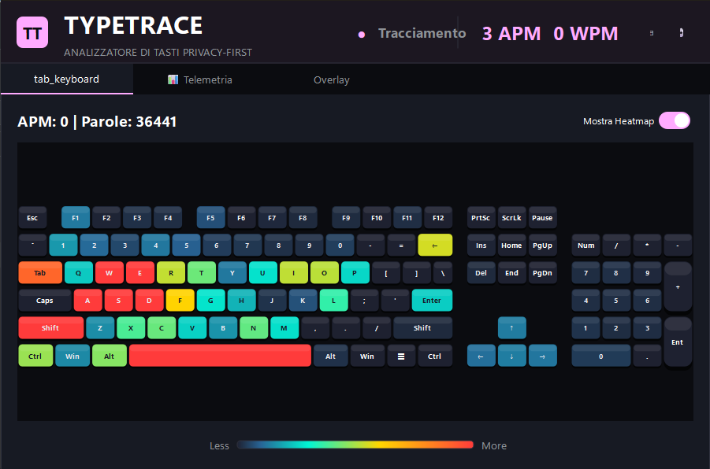
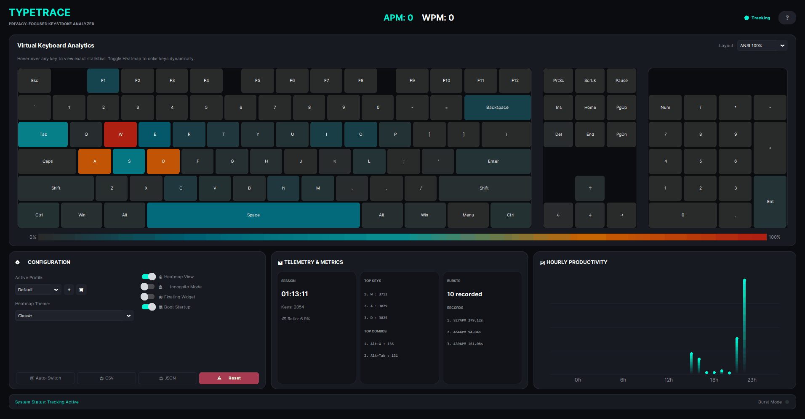

# 📊 TypeTrace — Premium Keyboard Analytics & Heatmap Dashboard

[](https://opensource.org/licenses/MIT)
[](https://www.python.org/)
[](https://www.microsoft.com/windows)
[](https://github.com/nickguti/TypeTrace/releases/latest)
[](https://github.com/nickguti/TypeTrace/releases/latest)

**TypeTrace** is a modern, thread-safe, and dark-themed desktop application written in Python to track, analyze, and visualize your typing habits and gaming performance globally in real-time.

---

## ⌨️ Key Features

- **⌨️ 100% Full-Size ANSI Virtual Keyboard:** Real-time keypress tracking with a smooth "Glow Effect" animation. Supports multiple layouts (100% Full-Size, TKL, 75%, 65%, and 60%).
- **🔥 Dynamic Heatmap Visualization:** Multi-theme support (Classic, Cyberpunk, Matrix, Stealth) using advanced color interpolation based on global key frequency.
- **🧠 Advanced Analytics:** Error-rate analysis (Backspace Ratio), live and peak APM/WPM monitoring, bigram transition tracking, and background "Burst Mode" detection for performance spikes.
- **🔧 Smart Automation (Process Auto-Switch):** Seamlessly context-aware profiles (e.g., automatically switches between "Gaming" and "Coding" based on the active Windows process).
- **🛡️ Local Privacy & Incognito Mode:** 100% local JSON storage (zero data telemetries) and a global hotkey (`Ctrl+Shift+I`) to instantly pause tracking.
- **🎛️ Floating In-Game Overlay:** A compact, borderless, always-on-top draggable widget showing live APM counter.

---


## 🚀 Quick Start (For General Users)

👉 [**Download TypeTrace.exe**](https://github.com/nickguti/TypeTrace/releases/latest)

Getting started with TypeTrace is simple and requires no setup:

1. Go to the **Releases** section on the right side of this repository.
2. Download the pre-compiled executable `TypeTrace.exe`.
3. Double-click `TypeTrace.exe` to run. No Python installation required!

---

## 🛠️ Installation & Setup (For Developers)

If you prefer to run the application from source or customize it, follow these steps:

### Prerequisites
- Python 3.9 or higher installed on your system.
- Windows Operating System (for process auto-switch API support).

### Setup Instructions

1. **Clone the repository:**
   ```bash
   git clone https://github.com/nickguti/typetrace.git
   cd typetrace
   ```

2. **Create and activate a virtual environment:**
   ```bash
   python -m venv venv
   # On Windows (Command Prompt):
   venv\Scripts\activate
   # On Windows (PowerShell):
   .\venv\Scripts\Activate.ps1
   ```

3. **Install dependencies:**
   ```bash
   pip install customtkinter pynput pystray Pillow
   ```

4. **Run the application:**
   ```bash
   python main.py
   ```
---

## 🗺️ Roadmap

- [ ] Linux & macOS support
- [ ] Weekly PDF report export
- [ ] Multi-language UI (EN / IT / ES)
- [ ] More heatmap themes
- [ ] Web dashboard (optional companion)
- [ ] Plugin system for custom analytics

---
## 📄 License

This project is licensed under the MIT License. See the [LICENSE](LICENSE) file for details.
